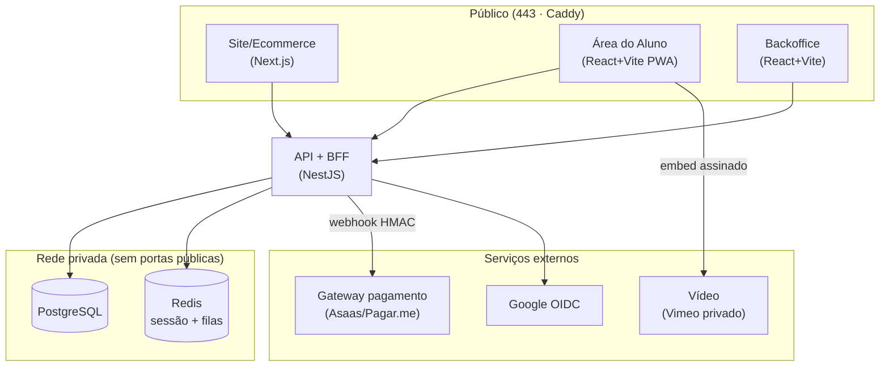
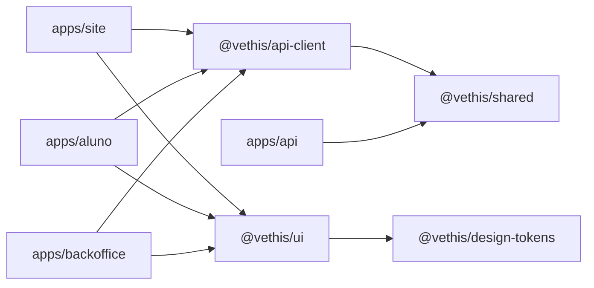

# Arquitetura — Vethis

Monólito modular com fronteiras por domínio. Clientes falam só com a API (BFF),
que mantém sessão (cookie httpOnly), injeta contexto (usuário/permissões) e agrega
chamadas. Ingress único público (Caddy, 443); banco/Redis/workers privados.

## Topologia

## Grafo de dependências dos pacotes

Sem dependências circulares. As dependências apontam para dentro (domínio).

## Domínios da API (módulos NestJS — M1+)

| Módulo                    | Responsabilidade                                                                 |
| ------------------------- | -------------------------------------------------------------------------------- |
| `auth`                    | registro, login, Google OIDC, sessão, MFA TOTP, RBAC                             |
| `users` / `organizations` | perfil; organizações + memberships (B2B modelado, UI na fase 2)                  |
| `catalog`                 | cursos → módulos → aulas (`vimeo_video_id`), especialidades, instrutores, preços |
| `orders` / `payments`     | checkout, pedido, port `PaymentGateway`, webhooks → evento `payment.confirmed`   |
| `enrollment` / `progress` | matrículas, progresso por aula, conclusão, certificado                           |
| `secretaria`              | solicitações do aluno (documentos, suporte) com status                           |
| `crm`                     | leads, funil, timeline de interações, notas (alimentada por eventos de domínio)  |
| `analytics`               | KPIs agregados para o dashboard do backoffice                                    |

## Fluxo de compra (referência)

1. Aluno compra no site → `orders` cria pedido → `payments` inicia cobrança no gateway.
2. Gateway confirma via **webhook assinado (HMAC)** → evento `payment.confirmed`.
3. `enrollment` matricula o aluno → `crm` registra na timeline → `analytics` atualiza KPIs.
4. Aluno acessa a área do aluno → assiste (embed Vimeo) → `progress` grava avanço.

Efeitos colaterais são desacoplados por **eventos de domínio** (fila no Redis) com
retry/back-off e dead-letter.
